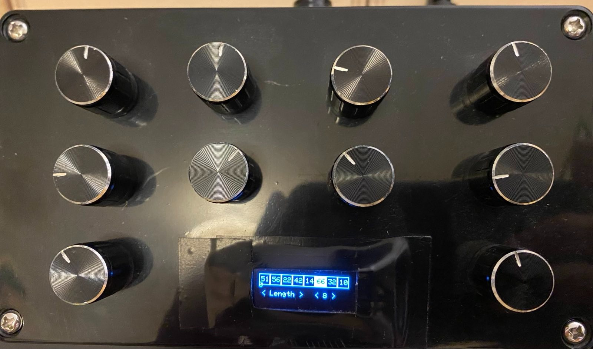

# Midi sequencer:

## Arduino uno based midi sequencer 

Circuit:
- 16 channel multiplexer
- adafruit display
- MIDI output on TX01

Features:
- Variable BPM and sequence length
- Selectable midi channel 
- Full range of MIDI notes output

